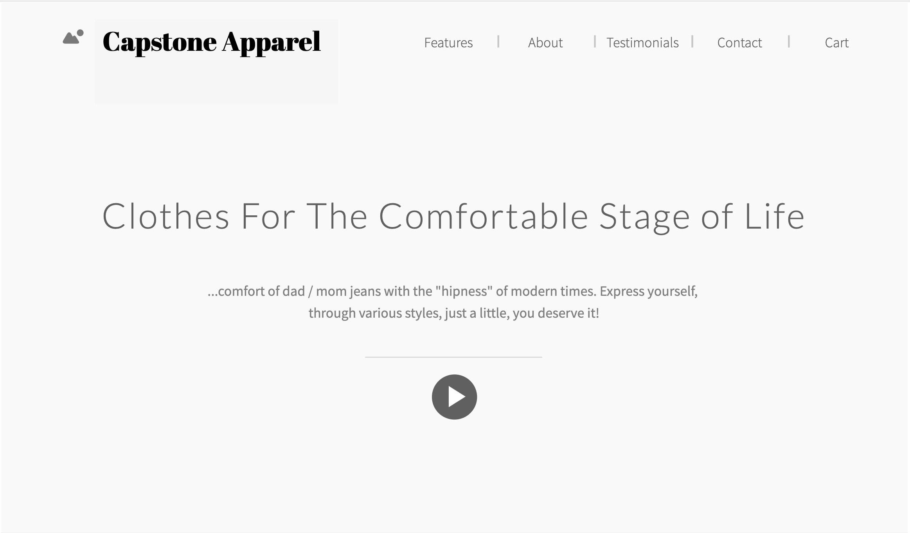
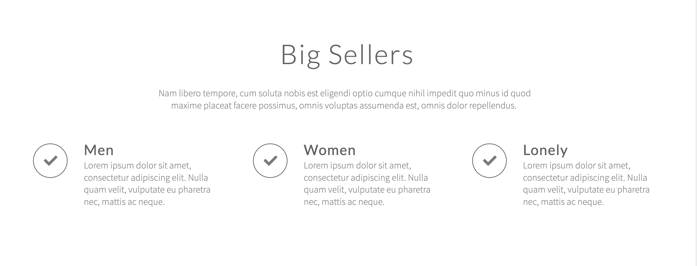
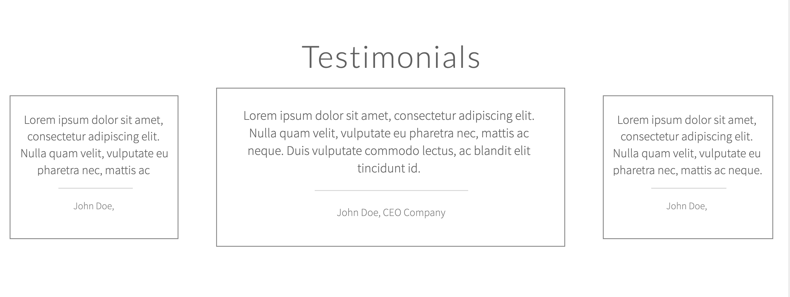
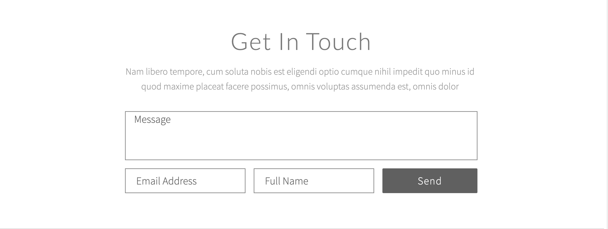
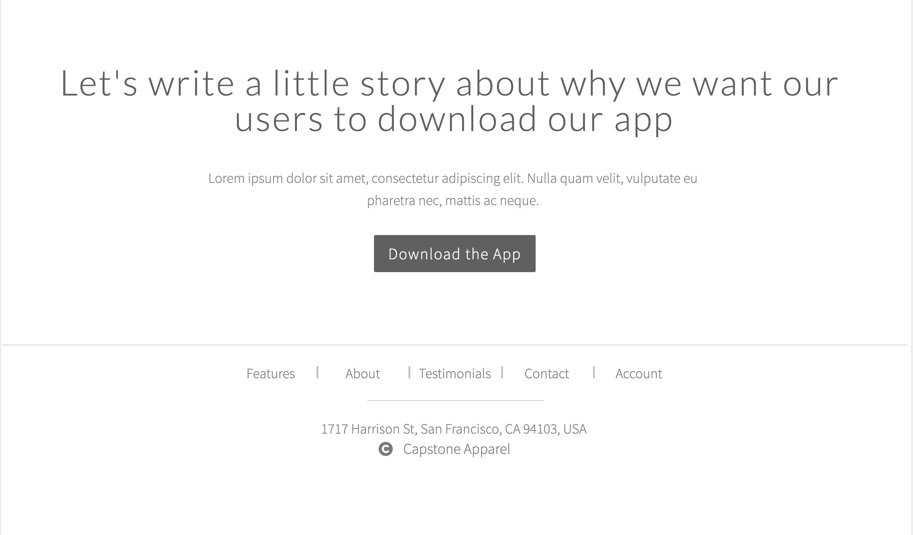

# Capstone-Apparel

### Purpose
This app will tailor to individuals, mid-forties, to offer a more viable and stylish options to their line of clothing. We're offering the comfort of dad jeans with the "hipness" of modern times. Express yourself, through various styles, just a little, you deserve it!

You can [** Pay us a visit **](https://facebook.github.io/create-react-app/docs/getting-started) here.

 

 #### Technologies Used
 + REACT
 + Springboot
 + Firebase
 + Surge
 + Heroku
 + aws

 

 #### To Run / Installation
 + npm -> npm install axios, nmp i react-router-dom
 + Firebase, 
 + Heroku, 
 + Surge,
 + aws

 ### Approach Taken...
 1. Minimalistic and Modern

 #### Problemss Encountered

 #### Planning Board
 
 1. Monday
    + Springboot JAVA
 2. Tuesday
    + JAVA
 3. Wednesday
    + Backend
 4. Thursday
    + CSS
 5. Friday
    + Backend
 6. Saturday
    + Typescript
 7. Sunday
    + CSS
 8. Monday
    + Backend/ Frontend
 9. Tuesday
    + deploy

                                    REFERENCES

##### FOR CSS
https://www.w3schools.com/css/css_link.asp

##### FOR XML

##### Javascript

